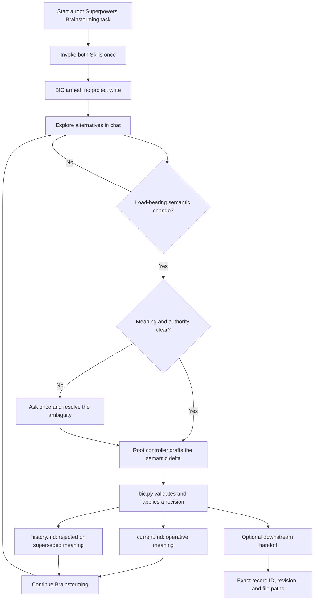
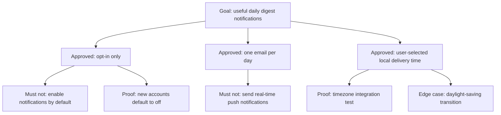

# Brainstorming Intent Continuity

[简体中文](README.zh-CN.md)

Brainstorming Intent Continuity (BIC) is an explicit companion Codex Skill for
[Superpowers](https://github.com/obra/superpowers) Brainstorming.

It preserves the load-bearing meaning developed during a Brainstorming
discussion—approved decisions, rejected directions, rationale, observable
proof, and important edge cases—without copying the whole conversation or
requiring the discussion to continue into a spec or implementation plan.

BIC is community-maintained. It does not bundle, fork, or modify Superpowers,
and it is not an official Superpowers component.

## Why this exists

Brainstorming is deliberately exploratory. A useful design may emerge through
repetition, revisions, rejected alternatives, counterexamples, and gradual
clarification.

When that discussion later becomes a summary, handoff, spec, plan,
implementation task, or review, some of its most important meaning can
disappear:

- the decision remains, but its rationale is lost;
- a rejected direction becomes plausible again;
- a concrete behavior is compressed into an ambiguous label;
- an edge case never reaches implementation or verification;
- a long task or context compaction weakens earlier alignment;
- the Brainstorming discussion never reaches a spec or plan at all.

BIC adds a small, project-owned continuity record at meaningful semantic
changes. It is neither a second development workflow nor a transcript archive.

## The core model

BIC separates three kinds of information:

| Layer | Where it lives | Meaning |
| --- | --- | --- |
| Exploration | Chat | Alternatives, drafts, repetition, and unfinished reasoning |
| Current intent | `current.md` | The operative goal, decisions, prohibitions, rationale, proof, edge cases, and open questions |
| Intent history | `history.md` | Rejected or superseded directions, reasons, turning points, and material counterexamples |

Each intent record contains two Markdown files and two synchronized Mermaid
projections:

- `current.md` contains the **Current Intent Map**;
- `history.md` contains the **Evolution Map**.

The written sections are always the semantic authority. Mermaid diagrams are
visual projections that make the same structure easier to inspect.

The Codex agent controlling the current root task (the root controller) is
responsible for keeping each projection semantically synchronized with the
text. `bic.py` validates the required structure and fenced blocks, not the
meaning of a diagram.

A useful rule of thumb is:

> If changing this meaning later would reasonably make the result feel
> different from what was agreed during Brainstorming, it belongs in the
> continuity record.

## Installation

Superpowers must be installed separately.

Add this repository as a Codex plugin marketplace:

```bash
codex plugin marketplace add GentleJinqi/Brainstorming-Intent-Continuity
```

Install the plugin:

```bash
codex plugin add brainstorming-intent-continuity@gentlejinqi-bic
```

Start a new Codex task after installation so the Skill is available in the new
task context.

The plugin switch in the Codex app controls whether BIC is available; it does
not run BIC automatically. After changing the switch, use a new task for a
clear activation boundary.

To uninstall it:

```bash
codex plugin remove brainstorming-intent-continuity@gentlejinqi-bic
```

Uninstalling the plugin does not delete `.brainstorming-intent/` records that
already belong to your projects.

## Start a continuity-enabled Brainstorming task

Explicitly invoke both Skills once at the beginning of a root Brainstorming
task, or when explicitly restarting that root Brainstorming flow:

```text
$superpowers:brainstorming
$brainstorming-intent-continuity:brainstorming-intent-continuity
```

Codex namespaces a plugin-contributed Skill as `plugin-name:skill-name`. In
this package, both names are `brainstorming-intent-continuity`, so the repeated
name is intentional.

The expected acknowledgement is:

```text
BIC armed — explicit session mode; no project record exists until a semantic event.
```

Once per continuous root discussion is enough. Repeating the pair within that
discussion resumes the same armed candidate or exact record; it must not create
a duplicate intent record.

Invoking Superpowers Brainstorming without BIC is intentional no-continuity
mode. BIC is not activated by quoted Skill names, pasted documentation,
prompt-text matching, or implicit hooks.

## How the workflow behaves

It is not a separate service or an automatic semantic-event detector.



Arming alone writes nothing. Ordinary exploration remains in chat.

While BIC is armed, the root controller creates a record lazily only when it
identifies and applies the first load-bearing semantic event, such as:

- an outcome-changing approval or rejection;
- a revision or supersession of an earlier direction;
- an accepted material non-goal, counterexample, or edge case;
- a material open question being created or resolved.

The root controller identifies the semantic delta and uses existing user
authority when it is already clear. It asks once only when the meaning is
materially ambiguous. The deterministic helper script validates and writes the
supplied record; it never interprets or summarizes the conversation itself.

Possible future compaction, agent dispatch, method changes, or Skill invocation
are not semantic events by themselves.

## Project-owned record layout

The first successful record update creates:

```text
.brainstorming-intent/
├── manifest.json
└── records/
    └── BIC-0001/
        ├── current.md
        └── history.md
```

`manifest.json` tracks stable record IDs, revisions, compatibility state, and
pending Git state. It does not store a transcript.

One intent lineage follows one accepted outcome and its constraints.
Requirements, examples, and refinements of that outcome remain in the same
lineage. An independent outcome starts a new lineage only after its own
load-bearing semantic event.

## Two files, two maps

The following example is synthetic and contains no real project data.

### Current Intent Map

Suppose a team is designing daily digest notifications. The operative record
says that notifications are opt-in, delivered once per day by email, and
scheduled using a user-selected local time.

Its `current.md` projection could be:



Only operative meaning belongs in `current.md`. When a decision is
superseded, its old wording is removed from this file.

### Evolution Map

Rejected and superseded meaning moves to `history.md` together with the reason
it changed.

The corresponding history projection could be:


This preserves the load-bearing evolution without making obsolete text compete
with the current design.

## Continuing without a spec or plan

BIC does not require Brainstorming to produce a design spec, implementation
plan, or code change.

A discussion may remain entirely within Brainstorming. Its continuity record
can still be revised as important meaning changes, recovered in a later task
through an exact pointer, or inspected as the current understanding of the
intent.

If downstream work does occur, the handoff includes the stable record ID,
revision, and exact paths:

```text
BIC pointer: BIC-0001 rev 3
current: <project>/.brainstorming-intent/records/BIC-0001/current.md
history: <project>/.brainstorming-intent/records/BIC-0001/history.md
```

A spec, plan, task brief, implementer, or reviewer should map only its relevant
decisions from that authority. It should not receive a copied transcript as a
substitute.

## Updates and conflict handling

Each successful update advances the record revision.

The writer uses an expected-revision check. If the record has changed since it
was read, the update fails closed so the controller must re-read the current
authority. It does not silently overwrite newer meaning.

Unsupported schema versions enter a read-only compatibility hold rather than
being migrated silently.

## Git behavior

Applying a record update never invokes Git automatically.

The update changes only `.brainstorming-intent/` and reports
`commit_pending`. Depending on project policy, those durable records may remain
as project-owned working-tree changes.

A complete registry snapshot may be committed only through the explicit
`commit-snapshot` operation and only when commit authority has been granted.
That operation covers the manifest and every registered lineage together while
preserving unrelated staged and modified files.

BIC reports the state of BIC-owned paths only. It never claims that the entire
worktree is clean.

## Privacy and project ownership

BIC stores the selected design meaning in the project that uses it. Those
records may contain information about that project and may later be committed
or pushed under the project's own rules. Inspect them before sharing a
repository publicly.

Optional session recovery writes `session-bindings.json` to plugin/runtime data
outside the project. It stores the session ID, absolute project/current/history
paths, record ID, and revision; it does not store design text or a transcript.
Absolute paths can reveal usernames or project names, so do not publish this
file.

This repository contains only product source, package metadata, public
documentation, synthetic examples, and tests. It does not include user
transcripts, project records, telemetry, hooks, or a network service. This
statement describes the plugin package, not the broader privacy behavior of
Codex or third-party tools in a user's environment.

## What BIC does not do

BIC does not:

- activate automatically whenever the word “brainstorming” appears;
- modify or replace Superpowers Brainstorming;
- save every message or preserve a complete transcript;
- treat every idea or wording change as a durable decision;
- make the helper script decide what the user meant;
- require a spec, plan, task decomposition, or implementation phase;
- create project files merely because compaction or handoff may happen;
- commit project files without explicit authority;
- guarantee that every nuance will be captured without inspection or
  correction.

The root controller remains responsible for semantic judgment. Users can
inspect and correct the Markdown authority whenever its meaning is incomplete
or inaccurate.

## Compatibility

Version `0.1.2` has been verified on Linux with Superpowers `6.3.0` and Codex
CLI `0.149.1`. The deterministic writer requires Python `3.9+` and POSIX file
locking. Native Windows is not currently supported; macOS has not yet been
verified.

Superpowers is an independent dependency and is not included in this
repository. Future Superpowers or Codex changes may require a compatibility
review before support is claimed.

## Contributing and feedback

Use [GitHub Issues](https://github.com/GentleJinqi/Brainstorming-Intent-Continuity/issues)
for bug reports, compatibility findings, and feature proposals.

Before posting an example, remove project names, private paths, prompts,
credentials, and other sensitive content.

See [CONTRIBUTING.md](CONTRIBUTING.md) for contribution guidance.

## License

[MIT](LICENSE)
