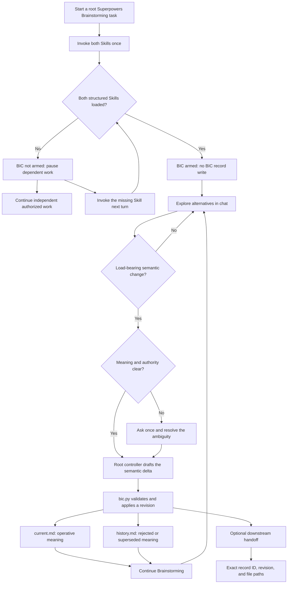
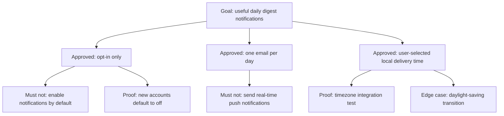

# Brainstorming Intent Continuity

[简体中文](README.zh-CN.md)

Brainstorming Intent Continuity (BIC) is an explicit companion Codex Skill for
[Superpowers](https://github.com/obra/superpowers) Brainstorming.

It preserves the load-bearing meaning developed during a Brainstorming
discussion—approved decisions, rejected directions, rationale, observable
proof, and important edge cases—without copying the whole conversation or
requiring the discussion to continue into a spec or implementation plan.

BIC is community-maintained. It does not bundle, fork, or modify Superpowers,
and it is not an official Superpowers component.

## Why this exists

Brainstorming is deliberately exploratory. A useful design may emerge through
repetition, revisions, rejected alternatives, counterexamples, and gradual
clarification.

When that discussion later becomes a summary, handoff, spec, plan,
implementation task, or review, some of its most important meaning can
disappear:

- the decision remains, but its rationale is lost;
- a rejected direction becomes plausible again;
- a concrete behavior is compressed into an ambiguous label;
- an edge case never reaches implementation or verification;
- a long task or context compaction weakens earlier alignment;
- the Brainstorming discussion never reaches a spec or plan at all.

BIC adds a small, project-owned continuity record at meaningful semantic
changes. It is neither a second development workflow nor a transcript archive.

## The core model

BIC separates three kinds of information:

| Layer | Where it lives | Meaning |
| --- | --- | --- |
| Exploration | Chat | Alternatives, drafts, repetition, and unfinished reasoning |
| Current intent | `current.md` | The operative goal, decisions, prohibitions, rationale, proof, edge cases, and open questions |
| Intent history | `history.md` | Rejected or superseded directions, reasons, turning points, and material counterexamples |

An ordinary intent record has an active pair of Markdown files and two
synchronized Mermaid projections:

- `current.md` contains the **Current Intent Map**;
- `history.md` contains the **Evolution Map**.

The written sections are always the semantic authority. Mermaid diagrams are
visual projections that make the same structure easier to inspect.

The Codex agent controlling the current root task (the root controller) is
responsible for keeping each projection semantically synchronized with the
text. `bic.py` validates the required structure and fenced blocks, not the
meaning of a diagram.

A useful rule of thumb is:

> If changing this meaning later would reasonably make the result feel
> different from what was agreed during Brainstorming, it belongs in the
> continuity record.

## Installation

Superpowers must be installed separately.

Add this repository as a Codex plugin marketplace:

```bash
codex plugin marketplace add GentleJinqi/Brainstorming-Intent-Continuity
```

Install the plugin:

```bash
codex plugin add brainstorming-intent-continuity@gentlejinqi-bic
```

Start a new Codex task after installation so the Skill is available in the new
task context.

The plugin switch in the Codex app controls whether BIC is available; it does
not run BIC automatically. After changing the switch, use a new task for a
clear activation boundary.

To uninstall it:

```bash
codex plugin remove brainstorming-intent-continuity@gentlejinqi-bic
```

Uninstalling the plugin does not delete `.brainstorming-intent/` records that
already belong to your projects.

### Upgrade an existing installation

Version `0.2.2` includes all changes since stable `0.2.0`. Version `0.2.1`
was an unpublished preparation version; there is no separate `0.2.1` release
to install first. The cumulative changes are:

- one truthful status on each turn using BIC, with activation and update
  receipts combined and no extra operation solely to display that status;
- reading only the reference sections needed for the operation and reusing
  valid exact state, with focused post-apply `--current-only` validation;
- carrying agreed current or saved intent into the same native spec and its
  applicable planning and review, preserving scope, evidence standards,
  accepted approximations and limits without adding completion conditions;
- replacing superseded operative wording, and asking for explicit ending
  confirmation when the complete agreed result is reviewable while respecting
  independent work and explicit stops;
- pausing dependent work on partial activation while independent authorized
  work continues, with structural loading and forward-only recovery boundaries.

Existing schema 2 projects need no migration. Schema 1 writes still require
explicit project migration authority; upgrading the plugin does not migrate
records. See [CHANGELOG.md](CHANGELOG.md) for the complete changes and limits.

After the release is published, refresh the configured marketplace first:

```bash
codex plugin marketplace upgrade gentlejinqi-bic
```

If the marketplace refresh fails, stop and keep the currently installed
version. After a successful refresh, reinstall the plugin from that snapshot:

```bash
codex plugin remove brainstorming-intent-continuity@gentlejinqi-bic
codex plugin add brainstorming-intent-continuity@gentlejinqi-bic
```

Verify the installed version:

```bash
codex plugin list --marketplace gentlejinqi-bic --json
```

Confirm that `brainstorming-intent-continuity@gentlejinqi-bic` is installed,
enabled, and reports version `0.2.2`. If it reports another version, the upgrade
is not yet verified.

Start a new Codex task after upgrading so the released Skill is loaded into
the new task context. Updating the plugin does not delete project-owned
`.brainstorming-intent/` records.

## Start a continuity-enabled Brainstorming task

Explicitly invoke both Skills once at the beginning of a root Brainstorming
task, or when explicitly restarting that root Brainstorming flow:

```text
$superpowers:brainstorming
$brainstorming-intent-continuity:brainstorming-intent-continuity
```

Codex namespaces a plugin-contributed Skill as `plugin-name:skill-name`. In
this package, both names are `brainstorming-intent-continuity`, so the repeated
name is intentional.

When both Skills are structurally loaded and the activation turn handles no
semantic event, the acknowledgement is:

```text
BIC armed — explicit session mode; no project record exists until a semantic event.
```

If the activation turn also handles a semantic event, process it under the
existing authority and give one truthful combined activation/update receipt at
the end, reflecting the actual outcome and record state. Do not first emit a
separate armed receipt or use no-record wording after a record has been created.

If Codex loads BIC but omits Superpowers Brainstorming, BIC fails closed and asks
you to invoke `$superpowers:brainstorming` in the next turn. If BIC itself was
not structurally loaded, invoke the plugin-qualified BIC Skill in the next turn.
Skill loading alone creates no project state. Activation-dependent work can
continue when both Skills are actually structurally loaded and existing
authority permits it; the visible receipt reports that state, does not establish
activation, and is not a prerequisite for continuing the work.

A partial activation pauses dependent Brainstorming/BIC work and leaves its
semantic content unrecorded. Independent authorized work can continue in the
same turn. Once the missing Skill is loaded, continuity is forward-only from
that turn. To recover meaning
from an older task or the partial turn, first present a brief controlled
bootstrap reconstruction and apply it only after the user explicitly confirms
it; never treat task history as an automatic backfill source.

Before presenting that controlled bootstrap reconstruction, inspect any
applicable native project authority and reconcile the reconstruction to it.
Native authority controls project state, source routing, lifecycle, evidence,
permissions and write eligibility, and handoff ownership over recovered Task
history and BIC defaults; BIC never overrides it. Do not apply where that
authority forbids the record or write; obtain user confirmation only after
reconciliation.

Once per continuous root discussion is enough. Repeating the pair within that
discussion resumes the same armed candidate or exact record; it must not create
a duplicate intent record.

Invoking Superpowers Brainstorming without BIC is intentional no-continuity
mode. BIC is not activated by quoted Skill names, pasted documentation,
prompt-text matching, or implicit hooks.

## How the workflow behaves

It is not a separate service or an automatic semantic-event detector.



Arming alone writes nothing. Ordinary exploration does not create a durable BIC
record; authorized native drafts can still be written inside the project.

While BIC is armed, the root controller creates a record lazily only when it
identifies and applies the first load-bearing semantic event, such as:

- an outcome-changing approval or rejection;
- a revision or supersession of an earlier direction;
- an accepted material non-goal, counterexample, or edge case;
- a material open question being created or resolved.

The root controller identifies the semantic delta and uses existing user
authority when it is already clear. It asks once only when the meaning is
materially ambiguous. The deterministic helper script validates and writes the
supplied record; it never interprets or summarizes the conversation itself.

Possible future compaction, agent dispatch, method changes, or Skill invocation
are not semantic events by themselves.

Every user-facing turn that actually uses BIC includes one short, truthful status,
normally at the end. The first armed/not-armed receipt or an update receipt counts;
progress messages do not each need another status. A continuing turn with no
record change can say: `BIC active — no record update this turn.` Paused, ended,
reference-only, partial, or uncertain use must report that actual state instead
of claiming active recording. Reading an ended record does not rearm it.

After a successful update, merge the status with the returned record/revision,
a one-sentence semantic delta, and the actual validation and `commit_pending`
state. The first creation also reports both exact record paths once; later
updates do not repeat the record body unless requested or handed off. Showing a
status is not a semantic event: it triggers no read, status command, write,
validation, save, binding, repeated Skill invocation, or ending question. Reuse
the known session state; the visible receipt does not itself prove activation.

## One result, one round

One record ID follows one deliverable discussion result, not an entire product,
Codex task, topic word, or file length. Refinements of the same result keep its
ID across tasks when writer ownership is handed off. An independent result gets
its own ID after a qualifying semantic event; this does not end the earlier round.

When the whole agreed result reaches its applicable reviewable endpoint, the
root explicitly asks whether its agreed questions are sufficiently answered and
whether the result may be delivered and the round ended, then obtains the user's
affirmative answer. A message, revision, local approval, or intermediate artifact
does not by itself establish that endpoint. If a spec is part of the agreed result, finish that work
before proposing completion; discussion-only results can end without a spec or
plan. Thanks, silence, a task switch, a spec, or a revision count cannot replace
explicit ending confirmation.

An `end` update records that confirmation as a new revision and saves its original
version in the same publication. Ending grants no successor authority. An open
BIC round does not block already authorized native discussion, drafting, review,
planning, or execution, subject to actual dependencies and permissions. One
native approval question may also request ending confirmation when both concern
the same complete result. If the user asks to continue or defer ending, continue
the relevant work; do not repeat the ending question on every turn. Ask again at
the user's requested point or after substantive progress to the complete result.

An explicit pause, cancellation, or end stops the corresponding discussion work.
Pause preserves an unfinished result; cancellation and replacement record their
own facts, including the successor relationship for replacement. Inactivity
implies none of them. Downstream reading or implementation does not reopen a
round. Repair execution that missed an unchanged approved design. Reopen an
ended commitment only for a concrete substantive defect, identifying the original
promise and affected scope, preserving the confirmed version and unaffected
conclusions, and obtaining ending confirmation again after revision.

## Project-owned record layout

The first successful record update creates:

```text
.brainstorming-intent/
├── manifest.json
└── records/BIC-0001/slots/a/
    ├── current.md
    └── history.md
```

`manifest.json` selects the active pair and tracks stable IDs, revisions, round
facts, saved versions, registered parts and corrections, and pending Git state.
It does not store a transcript. Later updates alternate at most two working
slots (`a` and `b`); the inactive slot is not a saved historical version.

Only when needed, the registry adds `versions/BIC-0001/rN/` for saved original
current/history and their descriptor, `parts/BIC-0001/DIGEST.md` for archived
history or effective topics, and `session-bindings.json` for session association.
Ordinary revisions do not create per-revision copies or empty archive indexes.
The writer publishes one complete revision through the manifest under a project
lock; readers obtain matching identity and bodies under the same shared lock.

All generated drafts, temporary output, records, parts, saved versions, and
bindings belong inside the project using BIC. Declare that location before
generating files, use its `.tmp/` for temporary work, and pass this boundary to
authorized delegates and tools. Resolved paths must remain inside the project.
The fixed Markdown headings, complete CLI and JSON contracts are in
[record-format.md](plugins/brainstorming-intent-continuity/skills/brainstorming-intent-continuity/references/record-format.md).
For an ordinary update, read its fixed Markdown and applicable CLI/JSON sections;
consult lifecycle, parts/corrections, binding/snapshot, migration, or helper
details only when the operation needs them. Already available exact content
does not need another read merely because a phase changes.

## Two files, two maps

The following example is synthetic and contains no real project data.

### Current Intent Map

Suppose a team is designing daily digest notifications. The operative record
says that notifications are opt-in, delivered once per day by email, and
scheduled using a user-selected local time.

Its `current.md` projection could be:



Only operative meaning belongs in `current.md`. When a decision is
superseded, replace its obsolete operative wording and repair any affected
passages in the native spec during the same writing or review. Appending a new
decision while leaving contradictory old instructions is insufficient. Routine
execution status stays in native task state unless it changes agreed intent or
an identified consumer needs it in the record.

### Evolution Map

Rejected and superseded meaning moves to `history.md` together with the reason
it changed.

The corresponding history projection could be:


This preserves the load-bearing evolution without making obsolete text compete
with the current design.

## Continuing without a spec or plan

BIC does not require Brainstorming to produce a design spec, implementation
plan, or code change.

A discussion may remain entirely within Brainstorming. Its continuity record
can still be revised as important meaning changes, recovered in a later task
through an exact pointer, or inspected as the current understanding of the
intent.

When a specific revision becomes a durable spec or handoff input, save the
original bodies and their necessary topic/history dependencies with
`save-version`, reusing an identical saved version. This does not increment the
semantic revision or end the round. Continued reading in the same context needs
no new copy. An `end` update saves its new confirmed revision automatically.

A handoff identifies the project, stable ID, revision, and actual returned paths,
and states whether it requests current effective content or a saved original.
For example, after successful preservation:

```text
BIC saved pointer: <project> | BIC-0001 rev 3
current: <project>/.brainstorming-intent/versions/BIC-0001/r3/current.md
history: <project>/.brainstorming-intent/versions/BIC-0001/r3/history.md
```

Use paths returned by successful apply/preservation, never guessed paths or a
new handoff summary in place of the originals. A saved version preserves the
then-current grounds; it does not override later user authority or automatically
update or reapprove a spec.

## Supplement the same native spec

When native Brainstorming needs a spec, obtain and consider the agreed BIC input
before forming the relevant design sections in that same native design and
review. This includes the corresponding current/history of an armed, associated
round or an agreed saved input from an ended round. The exact version already
obtained in context can be reused. The spec still draws on conversation, project
facts, applicable requirements, native exploration and tradeoffs, and the BIC
supplement. Effective user constraints keep their authority; rejected directions
stay history. Initial arming does not start a second exploration process.

If an independent discussion ends before a later spec, pass its actual saved
version and necessary reading instruction through the existing handoff. Reading
that input does not reopen the discussion. A new revision that records only
ending facts does not invalidate a semantically unchanged spec; a substantive
requirement change calls for repair and verification of the affected scope.

Express relevant requirements naturally in the native spec, with exact references
where useful. Include the BIC pointer and reading instruction in the existing
native review handoff, and repair omissions in that same spec. A link alone
does not express a requirement. BIC creates no second spec, required BIC headings,
extra review report, or second approval flow. Superpowers Skill files remain
unchanged. BIC supplies input to the existing native workflow; its methods and
approvals remain subject to current user, project and runtime authority. BIC
adds no native stages or approval gates and does not require an already authorized
step to be approved again; its own explicit round-ending confirmation remains.
Native writing-plans consumes the same spec. Carry the
accepted conditions, boundaries, necessary rationale, and observable outcomes
into the applicable plan, delegation, and execution review; matching task names,
feature presence, or test counts alone do not establish fidelity. Use the BIC
supplement to resolve actual omissions without requiring every downstream reader
to reread the full record, maintain a complete mapping, or add a BIC reviewer.
Unaccepted ideas and rejected directions do not become implementation scope.
Ordinary tasks without BIC continue normally, and paths that need no spec or plan
gain none; an existing research brief or protocol keeps its native role.

If an agreed input is unavailable, name the exact missing project/record/revision
or file and recover it from its explicit original source or known exact copies.
An exact version already present in context suffices; a later revision, summary,
or reconstruction does not. Do not guess another association or repeat exhausted
searches without a new lead. Carry registered later corrections with old content.
If recovery fails and no decision covers this incident, explain the omission and
its unknown impact, then ask whether the user accepts proceeding without this
particular input. Continue independent work while awaiting that answer, keep the
dependent obligation open, and do not claim the agreed supplement was used.
An accepted omission applies only to that incident; visible conversation alone
does not establish that unread material is dispensable.

## Validate a published revision

After `apply`, use its returned record ID and revision for a focused persisted
result check:

```text
validate --project PROJECT --record-id ID --current-only --expected-revision N
```

Both the ID and expected revision are required. The command rejects an advanced
revision and checks the current bodies, registered parts and corrections, plus
the saved copy of this same revision when one exists. It leaves unrelated older
saved versions and other records' bodies unread. Manifest metadata still receives
its shared integrity checks. The receipt states `validation_scope: current`;
it does not certify the whole registry.

`validate --project PROJECT [--record-id ID]` retains the full integrity audit,
including saved versions, and `commit-snapshot` still validates the complete
registered snapshot. A failure in unrelated historical material is reported in
that scope; it does not by itself invalidate a separately verified current result.

## Read, preserve, and associate an input

Resolve `BIC_SKILL_DIR` from the runtime-supplied Skill path, rather than assuming
the target project contains plugin source. Replace the example project, record,
revision and session with the exact known values. These examples assume an
enrolled schema 2 project with `BIC-0001` currently at revision 3:

```bash
BIC_SKILL_MD="/absolute/path/supplied-by-the-runtime/SKILL.md"
BIC_SKILL_DIR="$(cd "$(dirname "$BIC_SKILL_MD")" && pwd -P)"
BIC_PROJECT="/absolute/path/to/your-project"
python3 "${BIC_SKILL_DIR}/scripts/bic.py" read --project "$BIC_PROJECT" --record-id BIC-0001 --current
python3 "${BIC_SKILL_DIR}/scripts/bic.py" save-version --project "$BIC_PROJECT" --record-id BIC-0001 --revision 3
python3 "${BIC_SKILL_DIR}/scripts/bic.py" read --project "$BIC_PROJECT" --record-id BIC-0001 --revision 3
python3 "${BIC_SKILL_DIR}/scripts/bic.py" bind --project "$BIC_PROJECT" --session-id SESSION --record-id BIC-0001 --expected-revision 3
python3 "${BIC_SKILL_DIR}/scripts/bic.py" bind --project "$BIC_PROJECT" --session-id SESSION --lookup
```

`read --current` returns the effective revision. `read --revision N` prefers its
saved version; if unsaved but exactly current, it returns `source_kind: current`,
whose mutable paths are not durable references. Unavailable older revisions
return `version_unavailable`, never a newer substitute.

Setting a binding saves the expected **current** revision and registers its exact
saved paths inside `.brainstorming-intent/session-bindings.json`. If current has
advanced, setting it with the old expected revision returns `revision_conflict`.
An existing binding lookup and `read --revision N` can still resolve the old saved
input. Lookup is read-only, does not arm BIC, and grants no semantic write ownership.

For unusually long unfinished rounds, archive whole historical events with stable
entries for their scope, conditions and location. Deduplicate effective content
first; when needed, group it into actual topic bodies while current retains global
constraints and navigation covering every effective topic. Effective topic bodies
remain requirements. Neither size nor revision count ends a round or changes its ID.
Ordinary reads include effective topics and history navigation, not all archived
bodies. Add `--event E1` to either read mode to obtain a relevant old event and its
registered later corrections, distinguished by original/view/source revision.
Expand related history when the entry does not settle relevance. Keep original
events intact and distinguish later supersession from `recording_error`; an
offline old file cannot establish the absence of later corrections.

## Updates and conflict handling

Each successful update advances the record revision.

Reuse the exact project, record ID, and revision established by the last
successful operation. Use `status` for first lookup, missing state, or a concrete
conflict, not as a ritual before every update or visible receipt. This preserves
the expected-revision check and the focused post-apply validation described above.

The writer uses an expected-revision check. If the record has changed since it
was read, the update fails closed so the controller must re-read the current
authority. It does not silently overwrite newer meaning.

Unsupported schema versions enter a read-only compatibility hold rather than
being migrated silently.

### Explicit schema 1 migration

The `0.2.2` writer reads and validates schema 1 without changing it. Before
writing that project's old records, obtain project migration authority and run
this command using the same runtime helper/project setup above:

```bash
python3 "${BIC_SKILL_DIR}/scripts/bic.py" migrate --project "$BIC_PROJECT" --expected-schema 1
```

Migration preserves record IDs, revision numbers, current/history original bytes,
and pending flags. It records ending state as `unknown`, not inferred completion,
and does not invent unsaved historical versions. Original content moves into the
schema 2 working layout; use returned paths. The old schema 1 writer rejects
schema 2 in read-only `compatibility_hold`, so do not send a migrated project
back to an old writer for updates.

Old `bind --plugin-data ...` calls return `binding_migration_required` with the
project-local command guidance; they do not silently read, move, or alter old
external binding files. Re-establish a binding with an explicit project, session,
record and expected current revision. No other project is traversed or migrated.

## Git behavior

Applying a record update never invokes Git automatically.

The update changes only `.brainstorming-intent/` and reports
`commit_pending`. Depending on project policy, those durable records may remain
as project-owned working-tree changes.

A complete registry snapshot may be committed only through the explicit
`commit-snapshot` operation and only when commit authority has been granted.
That operation covers the manifest, every active record, saved descriptors and
their dependencies, and correction material together while preserving unrelated
staged and modified files. It excludes inactive working slots, temporary files,
and session runtime state. If a complete snapshot is not authorized, successful
record work remains `commit_pending`.

BIC reports the state of BIC-owned paths only. It never claims that the entire
worktree is clean.

## Privacy and project ownership

BIC stores the selected design meaning in the project that uses it. Those
records may contain information about that project and may later be committed
or pushed under the project's own rules. Inspect them before sharing a
repository publicly.

Optional session recovery writes `.brainstorming-intent/session-bindings.json`
inside the project. It stores the session ID, absolute project/saved-body paths,
record ID, and revision; it does not store design text or a transcript. BIC
snapshots exclude this runtime file. Absolute paths can reveal usernames or
project names, so inspect other sharing mechanisms separately.

This repository contains only product source, package metadata, public
documentation, synthetic examples, and tests. It does not include user
transcripts, project records, telemetry, hooks, or a network service. This
statement describes the plugin package, not the broader privacy behavior of
Codex or third-party tools in a user's environment.

## What BIC does not do

BIC does not:

- activate automatically whenever the word “brainstorming” appears;
- modify or replace Superpowers Brainstorming;
- save every message or preserve a complete transcript;
- treat every idea or wording change as a durable decision;
- make the helper script decide what the user meant;
- require a spec, plan, task decomposition, or implementation phase;
- create project files merely because compaction or handoff may happen;
- commit project files without explicit authority;
- guarantee that every nuance will be captured without inspection or
  correction.

The root controller remains responsible for semantic judgment. Users can
inspect and correct the Markdown authority whenever its meaning is incomplete
or inaccurate.

## Compatibility

Version `0.2.2` preserves the schema 2 storage and explicit discussion rounds
from `0.2.0`; existing schema 2 projects need no migration. Existing full
validation, its JSON receipt and complete-registry snapshot checks are
unchanged. Current-only validation requires an exact record ID and expected
revision; it checks manifest metadata and the selected current dependencies,
including correction parts, without auditing unrelated record bodies or old
saved views.

The earlier preparation passed 99 mechanical tests (29 CLI, 46 schema 2,
9 package and 15 validation-scope tests). These are automated checks, not 99
model conversations, and are not presented as a new run of the complete suite
for `0.2.2`. This release's local checks cover version metadata, public package
contracts and documentation consistency. They do not establish general
thinking-quality or net-efficiency gains. Installation and structural Skill
loading must be checked in a new task after upgrading; local source preparation
alone does not establish either. Validation scope is recorded in the changelog.

For historical compatibility, release `0.1.4` was verified on Linux with
Superpowers `6.3.0` and Codex CLI `0.149.1`. The deterministic writer requires
Python `3.9+` and POSIX file locking. Native Windows is not currently supported;
macOS has not yet been verified.

See [CHANGELOG.md](CHANGELOG.md) for release notes and
[GitHub Releases](https://github.com/GentleJinqi/Brainstorming-Intent-Continuity/releases)
for published versions.

Superpowers is an independent dependency and is not included in this
repository. Future Superpowers or Codex changes may require a compatibility
review before support is claimed.

## Contributing and feedback

Use [GitHub Issues](https://github.com/GentleJinqi/Brainstorming-Intent-Continuity/issues)
for bug reports, compatibility findings, and feature proposals.

Before posting an example, remove project names, private paths, prompts,
credentials, and other sensitive content.

See [CONTRIBUTING.md](CONTRIBUTING.md) for contribution guidance.

## License

[MIT](LICENSE)
