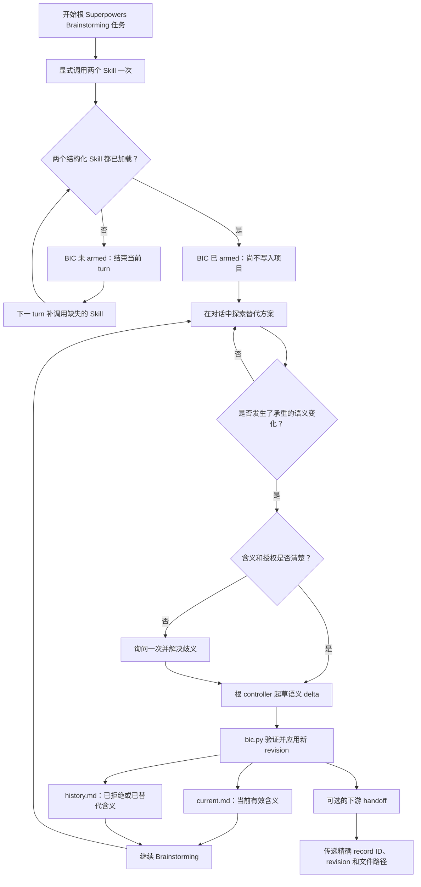
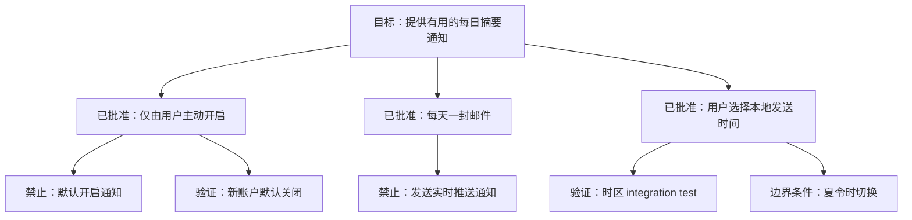

# Brainstorming Intent Continuity

[English](README.md)

Brainstorming Intent Continuity（BIC）是一个与
[Superpowers](https://github.com/obra/superpowers) Brainstorming 显式配对使用的
Codex companion Skill。

它用于保存 Brainstorming 中真正承重的语义——已经批准的决定、明确拒绝的方向、关键理由、
可观察的验证方式和重要边界条件——但不会复制整段对话，也不要求 Brainstorming 必须继续进入
spec 或 implementation plan。

BIC 是由社区维护的独立 companion。它不内置、不 fork、也不修改 Superpowers，并非
Superpowers 官方组件。

## 为什么需要它

Brainstorming 本来就是探索性的。一项真正可靠的设计，往往是在反复表达、修改、拒绝替代
方案、分析反例和逐渐澄清的过程中形成的。

当这段讨论后来被压缩为总结、handoff、spec、plan、implementation task 或 review 时，
一些最关键的含义可能消失：

- 保留了最后的决定，却丢失了作出决定的原因；
- 已经拒绝的方向在后续阶段重新变得“可选”；
- 一个具体行为被压缩成含义模糊的概念；
- edge case 没有进入实现或验证；
- 长任务或上下文压缩削弱了早期已经达成的对齐；
- Brainstorming 根本没有继续进入 spec 或 plan，已形成的理解因而没有持久化落点。

BIC 在真正发生语义变化时，维护一份小型、项目自有的连续性记录。它不是第二套开发
工作流，也不是聊天 transcript archive。

## 核心模型

BIC 将信息分为三层：

| 层级 | 保存位置 | 含义 |
| --- | --- | --- |
| 探索过程 | Chat | 替代方案、草稿、重复表达和尚未完成的推理 |
| 当前意图 | `current.md` | 当前有效的目标、决定、禁止项、理由、验证方式、边界条件和开放问题 |
| 意图历史 | `history.md` | 已拒绝或已被替代的方向、原因、关键转折和重要反例 |

每一条 intent record 都包含两个 Markdown 文件和两张同步更新的 Mermaid 图：

- `current.md` 包含 **Current Intent Map**；
- `history.md` 包含 **Evolution Map**。

文字章节始终是语义权威。Mermaid diagram 只是同一结构的可视化投影，帮助人更快理解和
检查。

负责当前根任务的 Codex agent（下文称 root controller）负责保证每张图与文字在语义上
同步。`bic.py` 验证的是必需结构和 fenced block，而不是 diagram 的含义。

一个实用判断标准是：

> 如果这项含义日后被改变，会使人合理地认为最终结果已经不同于 Brainstorming 中达成的
> 共识，那么它就应该进入连续性记录。

## 安装

Superpowers 需要单独安装。

先将本仓库添加为 Codex plugin marketplace：

```bash
codex plugin marketplace add GentleJinqi/Brainstorming-Intent-Continuity
```

然后安装插件：

```bash
codex plugin add brainstorming-intent-continuity@gentlejinqi-bic
```

安装后请新建一个 Codex 任务，使 Skill 能够进入新任务的上下文。

Codex APP 中的插件开关只控制 BIC 是否可用，并不代表 BIC 会自动运行。切换开关后，请
新建任务，以获得清晰的激活边界。

卸载命令为：

```bash
codex plugin remove brainstorming-intent-continuity@gentlejinqi-bic
```

卸载插件不会删除已经属于各个项目的 `.brainstorming-intent/` 记录。

## 开始一次启用连续性的 Brainstorming

在一次根 Brainstorming 任务开始时，或显式重启这条根 Brainstorming 流程时，调用这两个
Skill：

```text
$superpowers:brainstorming
$brainstorming-intent-continuity:brainstorming-intent-continuity
```

Codex 会把插件提供的 Skill 命名为 `plugin-name:skill-name`。本插件的插件名和
Skill 名都是 `brainstorming-intent-continuity`，因此这里的重复是有意的。

预期确认信息为：

```text
BIC armed — explicit session mode; no project record exists until a semantic event.
```

只有 Codex 已经结构化加载了两个 Skill，这条回执才成立。如果 Codex 已加载 BIC、但遗漏了
Superpowers Brainstorming，BIC 会 fail closed，并要求您在下一 turn 单独调用
`$superpowers:brainstorming`。如果完全没有出现 BIC 回执，则在下一 turn 单独调用插件限定名
BIC Skill。这两种重试都不会创建项目状态；只有出现 armed 回执后才继续。

partial activation 所在的 turn 会在 fail-closed 回执后立即结束。缺失的 Skill 加载成功后，
连续性默认从该 turn 开始，采用 forward-only。若要恢复旧任务或 partial turn 中的含义，先
给出一份简短的 controlled bootstrap 重建，并且只有在用户明确确认后才能写入；不得把任务
历史自动当成回填来源。

在呈现这份 controlled bootstrap 重建前，先检查适用的原生项目权威，并将重建内容与其协调一致。
原生权威优先决定项目状态、来源路由、生命周期、证据、权限和写入资格，以及 recovered
Task history 与 BIC 默认值之上的 handoff ownership；BIC 不得覆盖该权威。若该权威禁止记录或写入，则不得 apply；只能在完成协调后再取得用户确认。

每段连续的根讨论调用一次即可。同一轮讨论中重复调用时，应继续使用已经 armed 的候选意图
或现有 record，而不是创建重复记录。

只调用 Superpowers Brainstorming，表示有意使用不启用连续性记录的模式。引用 Skill 名称、
粘贴文档、普通 prompt 文本匹配或隐式 hook 都不会激活 BIC。

## 整体工作方式

它不是独立服务，也不是自动 semantic-event detector。



仅仅 armed 不会写入任何项目文件，普通探索继续留在对话中。

BIC 处于 armed 状态时，只有 root controller 识别并应用了第一项承重语义事件，才会按需
创建记录，例如：

- 会改变结果的批准或拒绝；
- 对既有方向的修改或替代；
- 已接受的重要 non-goal、反例或 edge case；
- 一个重要 open question 被创建或解决。

根 controller 识别语义 delta。当用户已经明确表达选择或拒绝时，它直接使用现有授权；
只有含义存在实质歧义时才询问一次。确定性 helper script 只负责验证和写入 controller 提供
的内容，它不会自行解释或总结对话。

未来可能发生的 compaction、agent dispatch、方法变化或 Skill 调用，本身都不属于语义
事件。

每次成功更新后，BIC 只显示一条紧凑回执：record/revision、一句 semantic delta，以及
`valid / commit_pending`。第一次创建还会显示一次两个精确路径；后续 revision 除非用户
要求或正在 handoff，否则不重复整份 record。

## 项目内的记录结构

第一次成功写入后，项目中会创建：

```text
.brainstorming-intent/
├── manifest.json
└── records/
    └── BIC-0001/
        ├── current.md
        └── history.md
```

`manifest.json` 负责记录稳定的 record ID、revision、兼容状态和待处理的 Git 状态。它不
保存聊天 transcript。

一条 intent lineage 对应一个已经接受的目标及其约束。这个目标的要求、例子和后续细化继续
保存在同一条 lineage 中。只有独立的新目标在发生自己的承重语义事件后，才开始新的
lineage。

## 两个文件、两张图

下面是完全虚构的合成示例，不包含任何真实项目数据。

### Current Intent Map

假设一个团队正在设计每日摘要通知。当前有效设计是：通知只能由用户主动开启，每天发送一封
邮件，并按照用户选择的本地时间发送。

它在 `current.md` 中的投影可以是：



`current.md` 只保留当前有效的含义。当一项决定被替代后，它的旧表述会从这个文件中移除。

### Evolution Map

已拒绝和已被替代的含义，会连同改变原因一起进入 `history.md`。

对应的历史投影可以是：


这样既保留了承重的演化过程，也不会让已经失效的旧文字继续与当前设计竞争。

## Brainstorming 不进入 spec 或 plan 也可以使用

BIC 不要求 Brainstorming 最终产出 design spec、implementation plan 或代码修改。

一次讨论完全可以始终停留在 Brainstorming 中。只要重要含义继续发生变化，它的 continuity
record 就可以继续更新；未来的新任务也可以通过精确 pointer 恢复它，或者直接把它作为当前
意图的可读权威。

如果后来确实进入下游工作，handoff 会包含稳定的 record ID、revision 和精确路径：

```text
BIC pointer: BIC-0001 rev 3
current: <project>/.brainstorming-intent/records/BIC-0001/current.md
history: <project>/.brainstorming-intent/records/BIC-0001/history.md
```

spec、plan、task brief、implementer 或 reviewer 只需要映射与自己工作相关的决定，不应以
复制整段 transcript 代替这份权威。

## 更新和冲突处理

每次成功更新都会增加 record revision。

writer 使用 expected-revision 检查。如果记录在读取后已经发生变化，本次更新会 fail
closed，controller 必须重新读取当前权威；它不会静默覆盖更新后的含义。

遇到不受支持的 schema 版本时，BIC 会进入只读的 compatibility hold，而不是静默迁移。

## Git 行为

应用记录更新时不会自动调用 Git。

更新只会改变 `.brainstorming-intent/`，并报告 `commit_pending`。根据不同项目的规则，这些
持久化记录可能暂时作为项目自有的 working-tree changes 保留。

只有在已经获得明确 commit 授权后，才能使用 `commit-snapshot` 创建完整 registry
snapshot。该操作会一起处理 manifest 和所有已登记的 lineage，同时保留无关的 staged 或
modified 文件。

BIC 只报告 BIC 自己所管理路径的状态，绝不会据此声称整个 worktree 是干净的。

## 隐私与项目所有权

BIC 会把选定的设计含义保存在使用它的项目中。这些记录可能包含该项目的信息，也可能根据
项目自身规则在之后被 commit 或 push。公开仓库之前，请检查这些记录。

可选的 session recovery 会在项目外的 plugin/runtime data 中写入
`session-bindings.json`。它保存 session ID、项目/current/history 的绝对路径、record ID
和 revision，但不保存设计正文或聊天 transcript。绝对路径可能暴露用户名或项目名，因此
不要公开这个文件。

本仓库只包含产品源码、package metadata、公开文档、虚构示例和测试，不包含用户
transcript、项目记录、telemetry、hook 或网络服务。这里描述的是插件包本身，不代表 Codex
或用户环境中第三方工具的整体隐私行为。

## BIC 不会做什么

BIC 不会：

- 因为文本中出现 “brainstorming” 就自动激活；
- 修改或替代 Superpowers Brainstorming；
- 保存每条消息或维护完整聊天 transcript；
- 把每一个想法或措辞变化都当作持久决定；
- 让 helper script 自行判断用户的真实意图；
- 强制要求 spec、plan、task decomposition 或 implementation 阶段；
- 仅仅因为未来可能发生 compaction 或 handoff 就创建项目文件；
- 在没有明确授权时自动提交项目文件；
- 保证无需人工检查或修正就能捕获所有细节。

根 controller 仍然负责语义判断。只要记录的含义不完整或不准确，用户都可以检查并纠正
Markdown 权威。

## 兼容性

版本 `0.1.4` 已在 Linux 环境中使用 Superpowers `6.3.0` 与 Codex CLI
`0.149.1` 完成验证。确定性 writer 需要 Python `3.9+` 和 POSIX 文件锁。当前不支持
原生 Windows；macOS 尚未经过实际验证。

发布说明请见 [CHANGELOG.md](CHANGELOG.md)，已发布版本请见
[GitHub Releases](https://github.com/GentleJinqi/Brainstorming-Intent-Continuity/releases)。

Superpowers 是独立依赖，不包含在本仓库内。Superpowers 或 Codex 后续发生变化时，在声明
支持前可能需要重新进行兼容性审核。

## 贡献和反馈

Bug、兼容性发现和功能建议请提交到
[GitHub Issues](https://github.com/GentleJinqi/Brainstorming-Intent-Continuity/issues)。

公开示例前，请移除项目名称、私有路径、prompt、凭据和其他敏感内容。

贡献方式见 [CONTRIBUTING.md](CONTRIBUTING.md)。

## License

[MIT](LICENSE)
