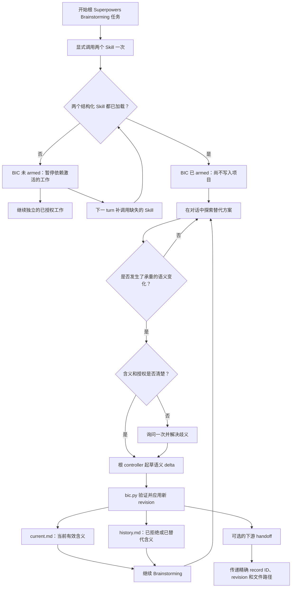
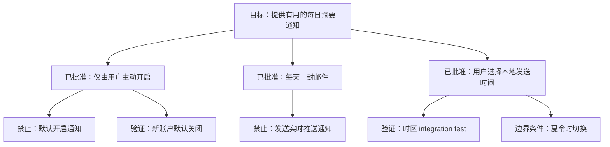

# Brainstorming Intent Continuity

[English](README.md)

Brainstorming Intent Continuity（BIC）是一个与
[Superpowers](https://github.com/obra/superpowers) Brainstorming 显式配对使用的
Codex companion Skill。

它用于保存 Brainstorming 中真正承重的语义——已经批准的决定、明确拒绝的方向、关键理由、
可观察的验证方式和重要边界条件——但不会复制整段对话，也不要求 Brainstorming 必须继续进入
spec 或 implementation plan。

BIC 是由社区维护的独立 companion。它不内置、不 fork、也不修改 Superpowers，并非
Superpowers 官方组件。

## 为什么需要它

Brainstorming 本来就是探索性的。一项真正可靠的设计，往往是在反复表达、修改、拒绝替代
方案、分析反例和逐渐澄清的过程中形成的。

当这段讨论后来被压缩为总结、handoff、spec、plan、implementation task 或 review 时，
一些最关键的含义可能消失：

- 保留了最后的决定，却丢失了作出决定的原因；
- 已经拒绝的方向在后续阶段重新变得“可选”；
- 一个具体行为被压缩成含义模糊的概念；
- edge case 没有进入实现或验证；
- 长任务或上下文压缩削弱了早期已经达成的对齐；
- Brainstorming 根本没有继续进入 spec 或 plan，已形成的理解因而没有持久化落点。

BIC 在真正发生语义变化时，维护一份小型、项目自有的连续性记录。它不是第二套开发
工作流，也不是聊天 transcript archive。

## 核心模型

BIC 将信息分为三层：

| 层级 | 保存位置 | 含义 |
| --- | --- | --- |
| 探索过程 | Chat | 替代方案、草稿、重复表达和尚未完成的推理 |
| 当前意图 | `current.md` | 当前有效的目标、决定、禁止项、理由、验证方式、边界条件和开放问题 |
| 意图历史 | `history.md` | 已拒绝或已被替代的方向、原因、关键转折和重要反例 |

普通 intent record 有一对活动 Markdown 正文和两张同步更新的 Mermaid 图：

- `current.md` 包含 **Current Intent Map**；
- `history.md` 包含 **Evolution Map**。

文字章节始终是语义权威。Mermaid diagram 只是同一结构的可视化投影，帮助人更快理解和
检查。

负责当前根任务的 Codex agent（下文称 root controller）负责保证每张图与文字在语义上
同步。`bic.py` 验证的是必需结构和 fenced block，而不是 diagram 的含义。

一个实用判断标准是：

> 如果这项含义日后被改变，会使人合理地认为最终结果已经不同于 Brainstorming 中达成的
> 共识，那么它就应该进入连续性记录。

## 安装

Superpowers 需要单独安装。

先将本仓库添加为 Codex plugin marketplace：

```bash
codex plugin marketplace add GentleJinqi/Brainstorming-Intent-Continuity
```

然后安装插件：

```bash
codex plugin add brainstorming-intent-continuity@gentlejinqi-bic
```

安装后请新建一个 Codex 任务，使 Skill 能够进入新任务的上下文。

Codex APP 中的插件开关只控制 BIC 是否可用，并不代表 BIC 会自动运行。切换开关后，请
新建任务，以获得清晰的激活边界。

卸载命令为：

```bash
codex plugin remove brainstorming-intent-continuity@gentlejinqi-bic
```

卸载插件不会删除已经属于各个项目的 `.brainstorming-intent/` 记录。

### 更新已有安装

BIC 发布新版本后，先刷新已经配置的 marketplace：

```bash
codex plugin marketplace upgrade gentlejinqi-bic
```

如果 marketplace 刷新失败，请停止更新并保留当前已安装版本。刷新成功后，从该 snapshot
重新安装插件：

```bash
codex plugin remove brainstorming-intent-continuity@gentlejinqi-bic
codex plugin add brainstorming-intent-continuity@gentlejinqi-bic
```

检查已安装版本：

```bash
codex plugin list
```

更新后请新建一个 Codex 任务，使已发布的 Skill 加载到新任务上下文。
更新插件不会删除项目自有的 `.brainstorming-intent/` 记录。

## 开始一次启用连续性的 Brainstorming

在一次根 Brainstorming 任务开始时，或显式重启这条根 Brainstorming 流程时，调用这两个
Skill：

```text
$superpowers:brainstorming
$brainstorming-intent-continuity:brainstorming-intent-continuity
```

Codex 会把插件提供的 Skill 命名为 `plugin-name:skill-name`。本插件的插件名和
Skill 名都是 `brainstorming-intent-continuity`，因此这里的重复是有意的。

预期确认信息为：

```text
BIC armed — explicit session mode; no project record exists until a semantic event.
```

只有 Codex 已经结构化加载了两个 Skill，这条回执才成立。如果 Codex 已加载 BIC、但遗漏了
Superpowers Brainstorming，BIC 会 fail closed，并要求您在下一 turn 单独调用
`$superpowers:brainstorming`。如果完全没有出现 BIC 回执，则在下一 turn 单独调用插件限定名
BIC Skill。这两种重试都不会创建项目状态；依赖激活的工作只有在出现 armed 回执后才继续。

partial activation 只暂停依赖激活的 Brainstorming/BIC 工作，不吸收该阶段的语义内容；
同一 turn 中不依赖激活的已授权工作可以继续。缺失的 Skill 加载成功后，
连续性默认从该 turn 开始，采用 forward-only。若要恢复旧任务或 partial turn 中的含义，先
给出一份简短的 controlled bootstrap 重建，并且只有在用户明确确认后才能写入；不得把任务
历史自动当成回填来源。

在呈现这份 controlled bootstrap 重建前，先检查适用的原生项目权威，并将重建内容与其协调一致。
原生权威优先决定项目状态、来源路由、生命周期、证据、权限和写入资格，以及 recovered
Task history 与 BIC 默认值之上的 handoff ownership；BIC 不得覆盖该权威。若该权威禁止记录或写入，则不得 apply；只能在完成协调后再取得用户确认。

每段连续的根讨论调用一次即可。同一轮讨论中重复调用时，应继续使用已经 armed 的候选意图
或现有 record，而不是创建重复记录。

只调用 Superpowers Brainstorming，表示有意使用不启用连续性记录的模式。引用 Skill 名称、
粘贴文档、普通 prompt 文本匹配或隐式 hook 都不会激活 BIC。

## 整体工作方式

它不是独立服务，也不是自动 semantic-event detector。



仅仅 armed 不会写入任何项目文件，普通探索继续留在对话中。

BIC 处于 armed 状态时，只有 root controller 识别并应用了第一项承重语义事件，才会按需
创建记录，例如：

- 会改变结果的批准或拒绝；
- 对既有方向的修改或替代；
- 已接受的重要 non-goal、反例或 edge case；
- 一个重要 open question 被创建或解决。

根 controller 识别语义 delta。当用户已经明确表达选择或拒绝时，它直接使用现有授权；
只有含义存在实质歧义时才询问一次。确定性 helper script 只负责验证和写入 controller 提供
的内容，它不会自行解释或总结对话。

未来可能发生的 compaction、agent dispatch、方法变化或 Skill 调用，本身都不属于语义
事件。

每次成功更新后，BIC 只显示一条紧凑回执：record/revision、一句 semantic delta，以及
`valid / commit_pending`。第一次创建还会显示一次两个精确路径；后续 revision 除非用户
要求或正在 handoff，否则不重复整份 record。

## 一个结果对应一轮讨论

一个 record ID 跟随一个可以交付并结束的讨论结果，不对应整个产品、Codex 任务、主题词或
文件长度。同一结果的细化保持原 ID；跨任务延续时需要交接写入归属。独立结果在发生自己的
语义事件后使用新 ID，这不会使旧轮自动结束。

标记 completed 前，root 必须明确询问：本轮约定的问题是否已经得到充分回答，是否确认
结果可以交付并结束本轮；随后取得用户肯定答复。局部批准、感谢、沉默、切换任务、已有 spec
或 revision 数量都不能替代这个确认。纯讨论结果也可以结束，不必生成 spec 或 plan。

`end` 更新把结束确认记为新 revision，并在同一次发布中保存该版原文。结束不授予后继工作
权限。BIC 尚未结束时，原生 spec 起草和审阅也可以继续；若原生批准与结束针对同一完整结果，
可在一个问题中明确请求两者。

暂停保留未完成结果；取消和替代各自记录真实状态，替代还记录后继关系。没有后续活动不代表
任何一种状态。下游阅读或实施不会重开轮次；若执行偏离未改变的已批准设计，修复执行即可。
只有已结束承诺出现具体实质缺陷时才有限重开，指出原承诺与受影响范围，保留已确认版本和
未受影响结论，并在修订后再次取得结束确认。

## 项目内的记录结构

第一次成功写入后，项目中会创建：

```text
.brainstorming-intent/
├── manifest.json
└── records/BIC-0001/slots/a/
    ├── current.md
    └── history.md
```

`manifest.json` 选择活动正文，并记录稳定 ID、revision、轮次事实、已保存版本、登记的
附属正文与订正，以及待处理的 Git 状态。它不保存聊天 transcript。后续更新至多轮换 `a`、
`b` 两组工作 slot；非活动 slot 不是已经保存的历史版本。

仅在需要时才增加：`versions/BIC-0001/rN/` 保存 current/history 原文及版本描述，
`parts/BIC-0001/DIGEST.md` 保存历史分卷或有效主题，`session-bindings.json` 保存会话
关联。普通 revision 不逐版复制，也不预建空存档索引。writer 在项目锁内通过 manifest
发布一个完整 revision；reader 在共享锁内取得同版身份和正文。

所有生成的草稿、临时输出、记录、附属正文、保存版本和绑定，都属于使用 BIC 的项目。
生成文件前声明位置，临时工作使用该项目的 `.tmp/`，并把边界传递给获准使用的代理和工具。
路径解析后也必须位于项目内。固定 Markdown 结构、完整 CLI 与 JSON 契约见
[record-format.md](plugins/brainstorming-intent-continuity/skills/brainstorming-intent-continuity/references/record-format.md)。

## 两个文件、两张图

下面是完全虚构的合成示例，不包含任何真实项目数据。

### Current Intent Map

假设一个团队正在设计每日摘要通知。当前有效设计是：通知只能由用户主动开启，每天发送一封
邮件，并按照用户选择的本地时间发送。

它在 `current.md` 中的投影可以是：



`current.md` 只保留当前有效的含义。当一项决定被替代后，它的旧表述会从这个文件中移除。

### Evolution Map

已拒绝和已被替代的含义，会连同改变原因一起进入 `history.md`。

对应的历史投影可以是：


这样既保留了承重的演化过程，也不会让已经失效的旧文字继续与当前设计竞争。

## Brainstorming 不进入 spec 或 plan 也可以使用

BIC 不要求 Brainstorming 最终产出 design spec、implementation plan 或代码修改。

一次讨论完全可以始终停留在 Brainstorming 中。只要重要含义继续发生变化，它的 continuity
record 就可以继续更新；未来的新任务也可以通过精确 pointer 恢复它，或者直接把它作为当前
意图的可读权威。

当某个具体 revision 成为需要持久引用的 spec 或 handoff 输入时，使用 `save-version`
保存正文原文及必要主题/历史依赖；相同已保存版直接复用。这不增加语义 revision，也不结束
轮次。同一上下文中的持续阅读不产生新副本；`end` 更新自动保存新的已确认版本。

handoff 包含项目、稳定 ID、revision 和实际返回路径，并说明请求的是当前有效内容还是
某个已保存原版。以下是成功保存后的示例：

```text
BIC saved pointer: <project> | BIC-0001 rev 3
current: <project>/.brainstorming-intent/versions/BIC-0001/r3/current.md
history: <project>/.brainstorming-intent/versions/BIC-0001/r3/history.md
```

使用成功 apply/保存返回的路径，不能猜测路径，也不能用新交接摘要替代原文。保存版本保留
当时依据，不覆盖后来的用户权威，也不会自动更新或重新批准旧 spec。

## 补充同一份原生 spec

BIC 已 armed、已关联且原生 Brainstorming 需要 spec 时，在同一次原生设计和审阅中取得并
实际考虑对应 current/history 或保存版本；上下文里已经取得的准确版本可以复用。spec
仍综合当前对话、项目事实、适用要求、原生探索与取舍，以及 BIC 补充资料。有效用户约束
保持效力；已拒绝方向保持历史身份。

把有关要求自然写入原生 spec，必要时附精确引用。在已有原生审阅交接中提供 BIC pointer
和阅读说明，发现遗漏就在同一份 spec 中修正。单独放链接不等于表达要求。BIC 不建立第二份
spec、指定 BIC 标题、额外 review report 或第二套批准流程。Superpowers Skill 文件保持
不变；BIC 向既有原生流程提供输入，其方法与审批服从当前用户、项目和运行环境的权威。
BIC 不增加阶段或审批，也不要求对已授权步骤重复批准。原生 writing-plans 使用同一份 spec，不要求每个下游读者
重读完整记录。普通未用 BIC 的任务照常进行；原本不需要 spec 或 plan 的路径不会因此增加。

约定输入不可用时，指出准确缺失的项目、记录、revision 或文件，从其显式原始来源或已知准确
副本恢复。上下文中已有的完整准确版本可以满足输入要求；新版、摘要或重建不能冒充原版。
不猜测其他关联，也不在没有新线索时重复已穷尽的搜索；读取旧内容时携带已登记的后续订正。
若无法恢复且尚无涵盖本次事件的决定，说明缺项及其影响无法完全确定，并询问用户是否接受
本次缺少该输入继续。等待答复时推进独立工作，保留依赖该输入的义务，不宣称已完成约定的
补充使用。用户接受缺项只覆盖本次事件；不能因为可见对话看似充分就判定未读资料可以跳过。

## 验证已发布的 revision

`apply` 成功后，使用它返回的 record ID 和 revision 检查实际落盘结果：

```text
validate --project PROJECT --record-id ID --current-only --expected-revision N
```

ID 和 expected revision 均为必填。若当前 revision 已推进，命令拒绝替换成新版进行验证。
检查覆盖当前正文、已登记的 part 与订正，以及存在时同一 revision 的保存副本；不读取无关
旧保存版本或其他记录的正文。manifest 元数据仍接受共享完整性检查。回执明确标注
`validation_scope: current`，不宣称整个 registry 已通过。

`validate --project PROJECT [--record-id ID]` 保留包含保存版本的完整性审计；
`commit-snapshot` 仍验证完整登记快照。无关历史材料的失败按其实际范围报告，不能单凭
该失败否定另行验证通过的当前结果。

## 读取、保存与关联输入

从运行时提供的 Skill 路径解析 `BIC_SKILL_DIR`，不要假设目标项目含有插件源码。把示例的
项目、record、revision、session 替换为准确已知值。以下示例假设项目已经使用 schema 2，
且 `BIC-0001` 当前为 revision 3：

```bash
BIC_SKILL_MD="/absolute/path/supplied-by-the-runtime/SKILL.md"
BIC_SKILL_DIR="$(cd "$(dirname "$BIC_SKILL_MD")" && pwd -P)"
BIC_PROJECT="/absolute/path/to/your-project"
python3 "${BIC_SKILL_DIR}/scripts/bic.py" read --project "$BIC_PROJECT" --record-id BIC-0001 --current
python3 "${BIC_SKILL_DIR}/scripts/bic.py" save-version --project "$BIC_PROJECT" --record-id BIC-0001 --revision 3
python3 "${BIC_SKILL_DIR}/scripts/bic.py" read --project "$BIC_PROJECT" --record-id BIC-0001 --revision 3
python3 "${BIC_SKILL_DIR}/scripts/bic.py" bind --project "$BIC_PROJECT" --session-id SESSION --record-id BIC-0001 --expected-revision 3
python3 "${BIC_SKILL_DIR}/scripts/bic.py" bind --project "$BIC_PROJECT" --session-id SESSION --lookup
```

`read --current` 返回实际有效版。`read --revision N` 优先读取保存版；若没有保存但恰好是
当前版，则返回 `source_kind: current`，其可变路径不能作为持久引用。不可用的旧版返回
`version_unavailable`，不会替换为较新版。

设置 binding 会保存预期的**当前 revision**，把准确保存路径登记在项目内的
`.brainstorming-intent/session-bindings.json`。若当前版已推进，使用旧 expected revision
设置绑定会返回 `revision_conflict`。已有 binding lookup 和 `read --revision N` 仍能
读取已保存旧版。lookup 只读，不会 armed，也不授予语义写入归属。

少见的长轮次可以按完整历史事件分卷，保留说明范围、条件和位置的稳定入口。先去重有效内容，
仍有需要时再按实际主题分组；current 保留全局约束及覆盖全部有效主题的导航。有效主题正文
仍是要求。字节数和 revision 数均不触发结束或换 ID。普通 read 返回有效主题与历史导航，
不展开全部存档。在任一 read 模式添加 `--event E1`，可读取有关旧事件及其已登记后续订正，
通过 original/view/source revision 区分时间。入口不足以判断相关性时扩展读取关联历史。
保留原事件，区分后来替代与 `recording_error`；离线旧文件不能证明不存在后续订正。

## 更新和冲突处理

每次成功更新都会增加 record revision。

writer 使用 expected-revision 检查。如果记录在读取后已经发生变化，本次更新会 fail
closed，controller 必须重新读取当前权威；它不会静默覆盖更新后的含义。

遇到不受支持的 schema 版本时，BIC 会进入只读的 compatibility hold，而不是静默迁移。

### 显式迁移 schema 1

`0.2.1` writer 可以只读查看和验证 schema 1。写入该项目旧记录前，应取得该项目的迁移
权限，再使用上面的运行时 helper/项目变量执行：

```bash
python3 "${BIC_SKILL_DIR}/scripts/bic.py" migrate --project "$BIC_PROJECT" --expected-schema 1
```

迁移保留 record ID、revision、current/history 原文字节和 pending 标志。结束状态记为
`unknown`，不推断完成，也不捏造未保存的历史版本。原内容进入 schema 2 工作结构，使用
返回的新路径。旧 schema 1 writer 遇到 schema 2 会只读 `compatibility_hold`，不能再让
旧 writer 更新已经迁移的项目。

旧 `bind --plugin-data ...` 调用返回 `binding_migration_required` 和项目内命令说明，
不会静默读取、移动或改写旧外部 binding 文件。重新关联需明确项目、session、record 和
预期当前 revision；不遍历或迁移其他项目。

## Git 行为

应用记录更新时不会自动调用 Git。

更新只会改变 `.brainstorming-intent/`，并报告 `commit_pending`。根据不同项目的规则，这些
持久化记录可能暂时作为项目自有的 working-tree changes 保留。

只有在已经获得明确 commit 授权后，才能使用 `commit-snapshot` 创建完整 registry
snapshot。该操作一起处理 manifest、全部活动记录、保存版 descriptor 及其依赖、订正正文，
同时保留无关 staged 或 modified 文件。非活动工作 slot、临时文件和 session runtime
state 不进入快照。若完整快照未获授权，成功记录的结果保持 `commit_pending`。

BIC 只报告 BIC 自己所管理路径的状态，绝不会据此声称整个 worktree 是干净的。

## 隐私与项目所有权

BIC 会把选定的设计含义保存在使用它的项目中。这些记录可能包含该项目的信息，也可能根据
项目自身规则在之后被 commit 或 push。公开仓库之前，请检查这些记录。

可选 session recovery 在项目内写入 `.brainstorming-intent/session-bindings.json`。
它保存 session ID、项目/保存正文的绝对路径、record ID 和 revision，不保存设计正文或聊天
transcript。BIC 快照排除这个运行状态文件；绝对路径仍可能暴露用户名或项目名，其他分享
方式需要单独检查。

本仓库只包含产品源码、package metadata、公开文档、虚构示例和测试，不包含用户
transcript、项目记录、telemetry、hook 或网络服务。这里描述的是插件包本身，不代表 Codex
或用户环境中第三方工具的整体隐私行为。

## BIC 不会做什么

BIC 不会：

- 因为文本中出现 “brainstorming” 就自动激活；
- 修改或替代 Superpowers Brainstorming；
- 保存每条消息或维护完整聊天 transcript；
- 把每一个想法或措辞变化都当作持久决定；
- 让 helper script 自行判断用户的真实意图；
- 强制要求 spec、plan、task decomposition 或 implementation 阶段；
- 仅仅因为未来可能发生 compaction 或 handoff 就创建项目文件；
- 在没有明确授权时自动提交项目文件；
- 保证无需人工检查或修正就能捕获所有细节。

根 controller 仍然负责语义判断。只要记录的含义不完整或不准确，用户都可以检查并纠正
Markdown 权威。

## 兼容性

本 README 描述 `0.2.1`，保留 `0.2.0` 的 schema 2 存储与显式讨论轮次；已有 schema 2
项目无需迁移。原有完整 validate、其 JSON 回执及完整 registry snapshot 检查保持不变。
新增的 current-only 验证明确报告较窄范围，并要求准确的 record ID 与 expected revision。

行为候选在 Python `3.9.18` 上通过了 99 项机械测试。五个合成 GPT-6 Astra 指令场景符合
预期规则，但不能证明普遍模型行为改善或性能提升。本地源码准备不代表已经发布，不会更新
已安装插件，也不能验证安装后新任务中的结构化 Skill 加载。验证观察及其限制记录于
changelog。

历史兼容性方面，发布版 `0.1.4` 曾在 Linux 环境中使用 Superpowers `6.3.0` 与 Codex CLI
`0.149.1` 完成验证。确定性 writer 需要 Python `3.9+` 和 POSIX 文件锁。当前不支持原生
Windows；macOS 尚未经过实际验证。

发布说明请见 [CHANGELOG.md](CHANGELOG.md)，已发布版本请见
[GitHub Releases](https://github.com/GentleJinqi/Brainstorming-Intent-Continuity/releases)。

Superpowers 是独立依赖，不包含在本仓库内。Superpowers 或 Codex 后续发生变化时，在声明
支持前可能需要重新进行兼容性审核。

## 贡献和反馈

Bug、兼容性发现和功能建议请提交到
[GitHub Issues](https://github.com/GentleJinqi/Brainstorming-Intent-Continuity/issues)。

公开示例前，请移除项目名称、私有路径、prompt、凭据和其他敏感内容。

贡献方式见 [CONTRIBUTING.md](CONTRIBUTING.md)。

## License

[MIT](LICENSE)
